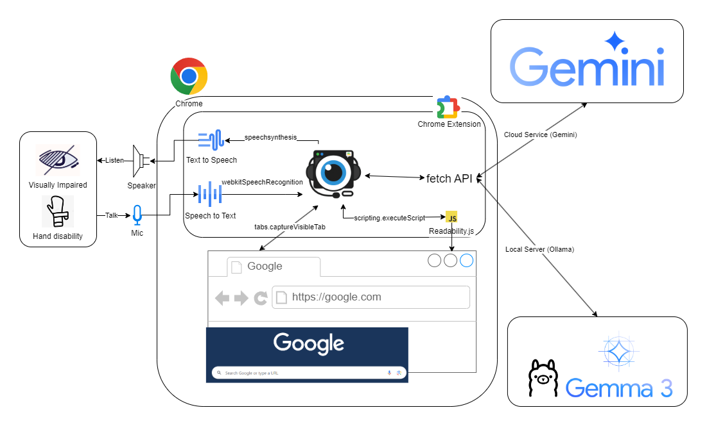

<p align="center">
    
    <h1 align="center">A-Eye Web Chat Assistant</h1>
</p>

<p align="center">
    <strong>Your AI-powered companion for a more accessible web.</strong>
</p>

<div align="center">


</div>

<p align="center">
    <a href="./README.zh.md"><strong>Read in Chinese</strong></a>
</p>

---

A-Eye is a free, open-source Chrome extension designed to make web browsing easier and more accessible, especially for users with visual impairments. Through intuitive AI chat, powerful screen analysis, and comprehensive voice control, it transforms how you interact with the web. You can freely choose between privacy-focused local AI services (Ollama, LM Studio and vLLM) or powerful cloud AI services (Google Gemini and Mistral AI).

## Key Features

-   **AI Screen Analysis**: Instantly understand webpage content by analyzing screenshots or full-page text with Gemini or local LLMs.
-   **Full Voice Control**: Use your voice to navigate, ask questions, and control the browser.
-   **Dual AI Modes**: Switch with a single click between powerful cloud AI and privacy-focused local AI.
-   **Web Page Interaction**: Tell the AI to click buttons or type text for you (e.g., "click the login button", "type 'hello world' in the search bar").
-   **Cross-Platform**: Works on any Windows, macOS, or Linux computer with Google Chrome.

## Getting Started

-   **Install the Extension**
    *   **Recommended**: Get it from the [Chrome Web Store](https://chromewebstore.google.com/detail/a-eye-web-chat-assistant/cdjignhknhdkldbjijipaaamodpfjflp).
    *   **Manual**: Download the code, go to `chrome://extensions`, enable "Developer mode", click "Load unpacked", and select the `src` folder.

## Configuration: Setting Up Your AI

You must configure at least one AI mode to enable the extension.

### Local AI Setup

Ideal for privacy. All processing happens on your computer.

<details>
<summary><strong>Click here for Local AI setup instructions</strong></summary>

#### Option 1: Automated PowerShell Script (Windows) (Ollama & Gemma 3)
This is the easiest method for Windows users.

---

1.  Choose the script based on your GPU's VRAM:
    *   **>= 6GB VRAM**: `setup_ollama_gemma3_4b.ps1`
    *   **>= 10GB VRAM**: `setup_ollama_gemma3_12b.ps1`
    *   **>= 20GB VRAM**: `setup_ollama_gemma3_27b.ps1`
2.  Open PowerShell and run the script (replace the path with your actual file path):
    ```powershell
    powershell.exe -ExecutionPolicy Bypass -File "C:\Path\To\Your\Script\setup_ollama_gemma3_4b.ps1"
    ```
3.  The script will automatically install Ollama, set permissions, and download your chosen model.
4.  In the extension's **Settings**, ensure "Local Model Name" matches the model you installed (e.g., `gemma3:4b`).

---

#### Option 2: Manual Setup (Ollama & Gemma 3)
1.  **Install [Ollama](https://ollama.com/)**.
2.  **Set CORS Permissions**: This allows the extension to talk to Ollama.
    *   **Windows**: Open CMD as Administrator and run `setx OLLAMA_ORIGINS "chrome-extension://*" /M`.
    *   **macOS/Linux**: Refer to Ollama's documentation for setting the `OLLAMA_ORIGINS` environment variable.
3.  **Restart Ollama** for the new settings to take effect.
4.  **Download a Model**: Open your terminal/CMD and run a command based on your GPU VRAM:
    *   **>= 6GB VRAM**: `ollama run gemma3:4b`
    *   **>= 10GB VRAM**: `ollama run gemma3:12b`
    *   **>= 20GB VRAM**: `ollama run gemma3:27b`
5.  In the extension's **Settings**, ensure "Local Model Name" matches the model you installed.

---

#### Option 3: Manual Setup LM Studio & Gemma 3
1.  **Install [LM Studio](https://lmstudio.ai/)**.
2.  **Download a Model**:
    *   In LM Studio, go to the 'Search' tab.
    *   Search for `google/gemma-3`.
    *   Choose the version suitable for your GPU's VRAM (e.g., `google/gemma-3-4b`) and click download.
3.  **Start the Local Server**:
    *   Go to LM Studio's 'Local Server' tab.
    *   Select the model you just downloaded.
    *   Click 'Start Server'.
4.  In the extension's **Settings**, ensure "LM Studio Model Name" matches the model path you used in LM Studio (e.g., `google/gemma-3-4b`).

---

#### Option 4: Manual Setup Gemini Nano

For more details, see the [Official Chrome Prompt API documentation](https://developer.chrome.com/docs/ai/prompt-api).
Note: Gemini Nano's Multimodal capabilities are currently only supported in Chrome Canary (https://www.google.com/chrome/canary/).

1.  **Open `chrome://flags` and enable:**
    | Flag | Value to set |
    | :--- | :--- |
    | Prompt API for Gemini Nano | Enabled |
    | Prompt API for Gemini Nano with Multimodal Input | Enabled |
    | Enables optimization guide on device | Enabled BypassPerfRequirement |

2.  **Restart Chrome**
3.  **Open Console (F12) and trigger download with progress**:
    ```javascript
    const session = await LanguageModel.create({
      monitor(m) {
        m.addEventListener("downloadprogress", (e) => {
          console.log(`Downloaded ${Math.round(e.loaded * 100)}%`);
        });
      },
    });
    ```
4.  **Check API availability**
    ```javascript
    await LanguageModel.availability();
    ```
    Once the status changes from `'downloading'` to `'available'`, Gemini Nano is ready to use.

</details>

### Cloud AI Setup

Ideal for maximum power and performance.

<details>
<summary><strong>Click here for Cloud AI setup instructions</strong></summary>

#### Option 1: Google AI Studio (Easiest)
1.  Visit [Google AI Studio](https://aistudio.google.com/).
2.  Click `Get API Key` > `Create API Key`.
3.  Copy the key.
4.  In the extension's **Settings**, paste it into the "Cloud API Key" field.

---

#### Option 2: Google Cloud Platform (Vertex AI)
For advanced users who want to manage their own GCP infrastructure. See the [GCP Setup Guide](./gcp/gcloud/README.md) for detailed instructions.

---

#### Option 3: Mistral AI
1.  Visit [Mistral AI Platform](https://console.mistral.ai/).
2.  Register or log in to your account.
3.  Navigate to the 'Try the API' > 'API Keys' and create a new API key.
4.  Copy your API key.
5.  In the extension's **Settings**, paste it into the "Mistral API Key" field.

</details>

## Commands & Shortcuts

| Action | Shortcut | Voice Command Examples |
| :--- | :--- | :--- |
| Open Side Panel | `Alt+Shift+Q` | - |
| Toggle AI Mode | `Alt+Shift+1` | - |
| Toggle Voice Input | `Alt+Shift+2` | - |
| Repeat Last Response | `Alt+Shift+3` | - |
| Capture Visible Area | - | "Take a screenshot" |
| Capture Full Page | - | "Take a scrolling screenshot" |
| Analyze Text Content | - | "Analyze content" |
| Clear Conversation | - | "Clear" |

## Architecture and Technologies

<details>
<summary><strong>Click here for technical details</strong></summary>

#### Chrome Extension & Web APIs
*   **Scripting API**: To execute content scripts (like Readability.js) in the context of the webpage.
*   **Side Panel API**: For the main user interface.
*   **Canvas API**: To stitch together multiple captures for the "Scrolling Screenshot" feature.
*   **Web Speech API**: For both `SpeechRecognition` (Speech-to-Text) and `SpeechSynthesis` (Text-to-Speech).

#### Backend & AI
*   **Local**: Communicates directly with locally running AI services, supporting OpenAI-compatible endpoints like Ollama, LM Studio, and vLLM.
*   **Cloud**: UUses a secure Google Cloud Platform serverless backend to proxy requests to cloud AI, or connects directly to third-party APIs.
    *   **API Gateway**: Provides a secure endpoint and validates API keys.
    *   **Cloud Functions**: A serverless function that receives requests and calls the AI model.
    *   **Vertex AI**: Hosts the powerful Gemini model for analysis.



</details>

## Privacy

A-Eye is built with privacy as a priority:
-   **No Data Collection**: The extension does not collect or transmit any personal data or browsing history to our servers.
-   **Secure Storage**: Your settings and API keys are stored only in your browser's local storage, inaccessible by websites.
-   **Local AI Option**: When using Local Mode, all data and AI processing remain entirely on your machine. Nothing is sent to the cloud.

## Credits

-   **Readability.js**: For article content extraction. Source: [mozilla/readability](https://github.com/mozilla/readability).

## License

This project is licensed under the [MIT License](./LICENSE).
