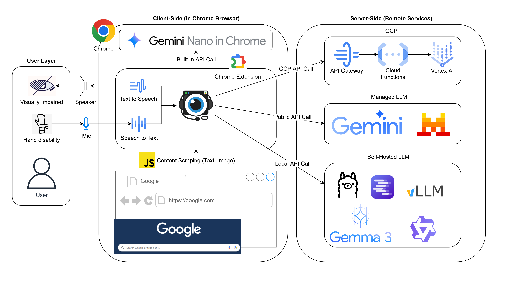

<p align="center">
    
    <h1 align="center">A-Eye 網頁聊天助理</h1>
</p>

<p align="center">
    <strong>您的人工智慧夥伴，為您打造無障礙的網路體驗。</strong>
</p>

<div align="center">


</div>

<p align="center">
    <a href="./README.md"><strong>Read in English</strong></a>
</p>

---

A-Eye 是一款免費、開源的 Chrome 擴充功能，旨在讓網頁瀏覽變得更輕鬆、更無障礙，尤其適合視障使用者。透過直觀的 AI 聊天、強大的螢幕分析以及全面的語音控制，它將徹底改變您與網路互動的方式。您可以自由選擇注重隱私的本地 AI 服務（Gemini Nano, Ollama, LM Studio和vLLM）或功能強大的雲端 AI 服務 (Google Gemini和Mistral AI)。



## 主要功能

-   **AI 螢幕分析**：透過分析螢幕截圖或網頁全文，即時理解頁面內容，支援 Gemini 及本地大型語言模型。
-   **全面語音控制**：使用您的聲音來導航、提問並控制瀏覽器。
-   **雙 AI 模式**：只需一鍵，即可在強大的雲端 AI 與保障隱私的本地 AI 之間輕鬆切換。
-   **網頁互動**：直接告訴 AI，讓它幫您點擊按鈕或輸入文字（例如：「點擊登入按鈕」、「在搜尋欄輸入『你好世界』」）。
-   **跨平台支援**：完美運行於安裝了 Google Chrome 的 Windows、macOS 及 Linux 電腦。

## 開始使用

-   **安裝擴充功能**
    *   **推薦方式**：由 [Chrome 線上應用程式商店](https://chromewebstore.google.com/detail/a-eye-web-chat-assistant/cdjignhknhdkldbjijipaaamodpfjflp)安裝。
    *   **手動安裝**：下載程式碼，在 Chrome 前往 `chrome://extensions`，啟用右上角的「開發人員模式」，然後點擊「載入未封裝項目」，並選取解壓縮後的 `src` 資料夾。

## 模型設定：配置您的 AI

您必須設定至少一種 AI 模式，才能啟用本擴充功能。

### 本地 AI 設定

最適合注重隱私的使用者，所有運算皆在您自己的電腦上完成。

<details>
<summary><strong>點擊此處展開本地 AI 設定說明</strong></summary>

---

#### Ollama
1.  **安裝 [Ollama](https://ollama.com/)**。
2.  **設定 CORS 權限**：此步驟是為了讓擴充功能與 Ollama 通訊。
    *   **Windows**: 以系統管理員身分開啟 CMD，然後執行 `setx OLLAMA_ORIGINS "chrome-extension://*" /M`。
    *   **macOS/Linux**: 請參考 Ollama 的官方文件，設定 `OLLAMA_ORIGINS` 環境變數。
3.  **重新啟動 Ollama**，使新設定生效。
4.  **下載模型**：開啟您的終端機/CMD，根據您顯示卡的 VRAM 執行相應指令：
    *   **>= 6GB VRAM**: `ollama run gemma3:4b`
    *   **>= 10GB VRAM**: `ollama run gemma3:12b`
    *   **>= 20GB VRAM**: `ollama run gemma3:27b`
5.  在擴充功能的 **設定** 頁面，確保「Ollama Model Name」與您所安裝的模型一致。

---

#### LM Studio
1.  **安裝 [LM Studio](https://lmstudio.ai/)**。
2.  **下載模型**：
    *   在 LM Studio 中，前往「搜尋」頁面。
    *   搜尋 `google/gemma-3`。
    *   選擇適合您顯示卡 VRAM 的版本（例如 `google/gemma-3-4b`），然後點擊下載。
3.  **啟動本地伺服器**：
    *   前往 LM Studio 的「本地伺服器」頁面。
    *   選擇您剛剛下載的模型。
    *   點擊「啟動伺服器」。
4.  在擴充功能的 **設定** 頁面，確保「LM Studio Model Name」與您在 LM Studio 中使用的模型路徑一致（例如 `google/gemma-3-4b`）。

---

#### Gemini Nano

更多細節請參考 [Gemini Nano API](https://developer.chrome.com/docs/ai/prompt-api)。
注意：Gemini Nano 的 Multimodal 功能目前僅支援於 [Chrome Canary](https://www.google.com/chrome/canary/)。

1.  **開啟 `chrome://flags` 並啟用：**
    | 標記 | 設定值 |
    | :--- | :--- |
    | Prompt API for Gemini Nano | Enabled |
    | Prompt API for Gemini Nano with Multimodal Input | Enabled |
    | Enables optimization guide on device | Enabled BypassPerfRequirement |
2.  **重新啟動 Chrome**
3.  **開啟主控台(F12)並以進度觸發下載：**
    ```javascript
    const session = await LanguageModel.create({
      monitor(m) {
        m.addEventListener("downloadprogress", (e) => {
          console.log(`Downloaded ${Math.round(e.loaded * 100)}%`);
        });
      },
    });
    ```
4.  **檢查 API 可用性**
    ```javascript
    await LanguageModel.availability();
    ```
    當狀態從 `'downloading'` 變為 `'available'`，即代表 Gemini Nano 已可使用。

---

</details>

### 雲端 AI 設定

追求極致效能與表現的最佳選擇。

<details>
<summary><strong>點擊此處展開雲端 AI 設定說明</strong></summary>

---

#### Google AI Studio API Key
1.  前往 [Google AI Studio](https://aistudio.google.com/)。
2.  點擊 `Get API Key` > `Create API Key`。
3.  複製您的 API 金鑰。
4.  在擴充功能的 **設定** 頁面，將其貼上至「Gemini API Key」欄位。

---

#### Mistral AI API Key
1.  前往 [Mistral AI 平台](https://console.mistral.ai/)。
2.  註冊或登入您的帳號。
3.  導航至「Try the API」>「API Keys」頁面，建立一個新的 API 金鑰。
4.  複製您的 API 金鑰。
5.  在擴充功能的 **設定** 頁面，將其貼上至「Mistral API Key」欄位。

---

#### 雲端平台：Google Cloud Platform (Vertex AI)
適合想自行管理 GCP 基礎設施的進階使用者。詳細步驟請參閱 [A-Eye-Web-Chat-Assistant-Cloud-Infra](./gcp/)。

---

</details>

## 指令與快捷鍵

| 操作 | 快捷鍵 | 語音指令範例 |
| :--- | :--- | :--- |
| 開啟側邊面板 | `Alt+Shift+Q` | - |
| 切換 AI 模式 | `Alt+Shift+1` | - |
| 開關語音輸入 | `Alt+Shift+2` | - |
| 重複上次回應 | `Alt+Shift+3` | - |
| 擷取可見範圍 | - | "Take a screenshot" |
| 擷取整個網頁 | - | "Take a scrolling screenshot" |
| 分析網頁文字 | - | "Analyze content" |
| 清除對話 | - | "Clear" |


## 隱私保障

A-Eye 將保障使用者隱私置於首位：
-   **不收集資料**：本擴充功能不會收集或傳送任何個人資料或瀏覽紀錄至我們的伺服器。
-   **安全儲存**：您的設定與 API 金鑰僅會儲存於您瀏覽器的本機儲存空間，網站無法存取。
-   **本地 AI 選項**：當您使用本地模式時，所有資料與 AI 運算皆完全在您自己的電腦上進行，絕不會傳送至雲端。

## 授權條款

本專案採用 [MIT 授權條款](./LICENSE) 授權。
